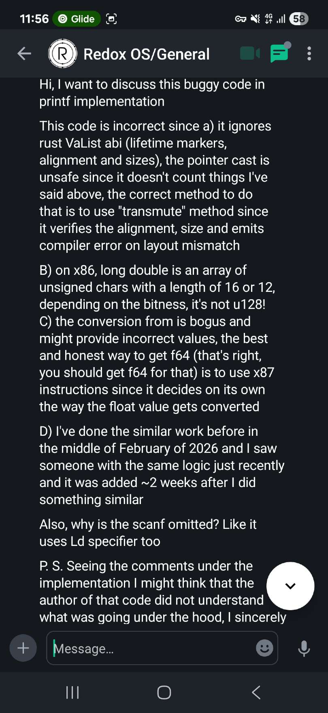
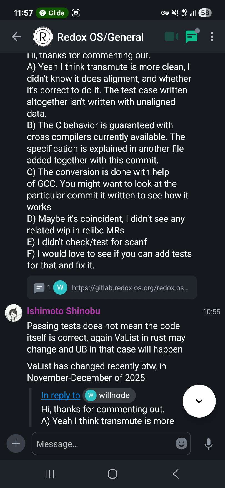
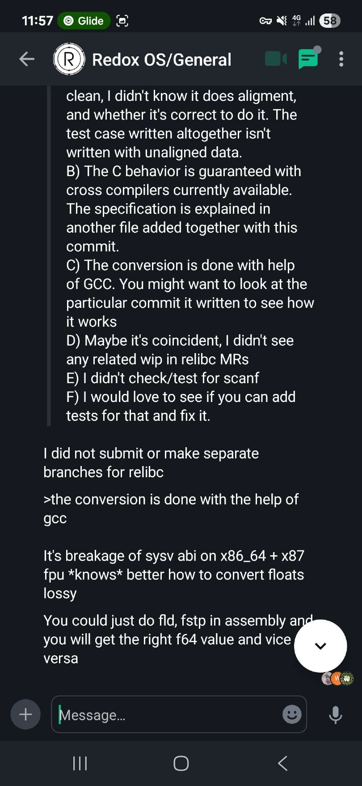

# Seven years unimplemented. Three weeks after I published the solution, it appeared in Redox OS with AGPLv3 violation

## Intro. Who am I?
I am keepitupkitty, 22 year old amateur programmer who writes in C, C++ and Rust most of the time. I love doing it so much and so I decided to write my own libc in Rust for my own GNU/Linux distribution. Why? I want a secure solution that implements wide support for compiler (and not only) mitigation like LLVM SafeStack, cross-DSO CFI and much more, additionally using Rust essentially **forces** programmer to write correct and memory safe code which also benefits overall safety and reliablity of the libc. Before the accusations to my side I will say that I use LLVM, *BSD and glibc code to see how things shall be done and to understand them more precisely.

## Issues implementing libc in pure Rust
As someone who programs in Rust might now that Rust supports C FFI and thus C variadic arguments, although it is considered to be an unstable feature, also someone might know too, that C has a special type called `long double` which differs across ABIs. One of such ABI was System V ABI for both 32-bit and 64-bit x86 processors. The key difference from the rest is that both ABIs use 80-bit Intel x87 floating point numbers for `long double` types which has better precision compared to binary 64-bit IEEE 754 float type, known in C as `double`. This float type is **NOT** supported by Rust and as of March 19 of 2026 there is no RFCs for supporting such type leaving developers who build libcs either to change the compiler (to make `long double` to be `double`) or leave support for %L{f,F,g,G,e,E,a,A} behind or worse (in case of `strtold`), do bad casts for routines that return `long double`.
Another issue is that Rust has set boundaries for the types that can be fetched from variadics, especially it is enforced by `unsafe trait VaArgSafe`. Since I do not want to hassle with compilers in hope nothing will break, I had to come up with an elegant solution.

## A brilliant idea that has came to me while I was reading Rust's `core` library source
Recently, Rust developers have added support for `f128` type, which is 128-bit binary IEEE 754 quadruple precision float type. While reading through, this piece of code from the f128 implementation caught my eye:
```rust
    #[inline]
    #[must_use]
    #[unstable(feature = "f128", issue = "116909")]
    #[allow(unnecessary_transmutes)]
    pub const fn from_bits(v: u128) -> Self {
        // It turns out the safety issues with sNaN were overblown! Hooray!
        // SAFETY: `u128` is a plain old datatype so we can always transmute from it.
        unsafe { mem::transmute(v) }
    }
```
You see the `transmute` method that can reinterpret the bits of type A to type B which is suited for use with Rust types and which also checks for the size and alignment during the compile time and emits an error on mismatch on size and/or alignment of source type and target type. Tastes like `memcpy` a bit. Brilliant! So I was thinking

> Hmmm, what if I clone VaList struct as a separate struct, including lifetime markers, methods and then make a separate method to extract bytes of long double (either it be IEEE 754 quadruple precision float number or 80-bit Intel extended precision float number) and then using transmute method, I will copy data of the private VaList to my ExtVaList, extract bytes and transmute it back to original VaList with data of VaList being overwritten with ExtVaList?

And then, with the help of System V ABI papers, on February 14th (St. Valentine day!) I have made a public repository for that, for the sake of testing it. I called it "clever-x86-hack-for-rust" with the following description "Extract long doubles (and possibly other types) from X86_64 stack!" that implements this hack. I made this repository public to show it to my friends, 4 days later I licensed it with AGPLv3 license.
The code:

```rust
#![feature(c_variadic, phantom_variance_markers, core_intrinsics)]
use core::{
  ffi::{VaList, c_char, c_void},
  fmt,
  intrinsics::{va_copy, va_end},
  marker::PhantomCovariantLifetime
};
// X86-64
#[cfg(target_arch = "x86_64")]
mod this {
  use core::ffi::c_void;
  #[repr(C)]
  #[derive(Debug, Clone, Copy)]
  pub struct ExtVaListInner {
    pub gp_offset: i32,
    pub fp_offset: i32,
    pub overflow_arg_area: *const c_void,
    pub reg_save_area: *const c_void
  }
}
// X86
#[cfg(target_arch = "x86")]
mod this {
  use core::ffi::c_void;
  #[repr(C)]
  #[derive(Debug, Clone, Copy)]
  pub struct ExtVaListInner {
    pub ptr: *const c_void
  }
}
#[repr(transparent)]
pub struct ExtVaList<'a> {
  inner: this::ExtVaListInner,
  _marker: PhantomCovariantLifetime<'a>
}
impl<'a> ExtVaList<'a> {
  #[inline]
  pub unsafe fn from_va_list(va: VaList<'a>) -> Self {
    let orig = core::mem::size_of::<VaList>();
    let ext = core::mem::size_of::<Self>();
    assert_eq!(orig, ext, "Sizes between VaList and ExtVaList differ");
    let align_orig = core::mem::align_of::<VaList>();
    let align_ext = core::mem::align_of::<Self>();
    assert_eq!(
      align_orig, align_ext,
      "Alignments between VaList and ExtVaList differ"
    );
    unsafe { core::mem::transmute(va) }
  }
  #[inline]
  pub unsafe fn into_va_list(self) -> VaList<'a> {
    unsafe { core::mem::transmute(self) }
  }
}
impl<'f> ExtVaList<'f> {
  #[inline]
  #[cfg(target_arch = "x86_64")]
  pub unsafe fn get_long_double_bits(&mut self) -> [u8; 16] {
    let aligned = self.inner.overflow_arg_area as usize & !15;
    let src = aligned as *const [u8; 16];
    let result = unsafe { src.read() };
    self.inner.overflow_arg_area = (aligned + 16) as *const c_void;
    result
  }
  #[inline]
  #[cfg(target_arch = "x86")]
  pub unsafe fn get_long_double_bits(&mut self) -> [u8; 12] {
    let aligned = (self.inner.ptr as usize + 3) & !3;
    let src = aligned as *const [u8; 12];
    let result = unsafe { src.read() };
    self.inner.ptr = (aligned + 12) as *const c_void;
    result
  }
}
impl fmt::Debug for ExtVaList<'_> {
  fn fmt(
    &self,
    f: &mut fmt::Formatter<'_>
  ) -> fmt::Result {
    f.debug_tuple("ExtVaList").field(&self.inner).finish()
  }
}
impl Clone for ExtVaList<'_> {
  #[inline]
  fn clone(&self) -> Self {
    unsafe { core::mem::transmute(va_copy(core::mem::transmute(self))) }
  }
}
impl<'f> Drop for ExtVaList<'f> {
  fn drop(&mut self) {
    unsafe { va_end(core::mem::transmute(self)) }
  }
}
// TEST CODE
#[unsafe(no_mangle)]
pub unsafe extern "C" fn my_test_c(
  s: *const c_char,
  mut args: ...
) {
  let mut t = unsafe { ExtVaList::from_va_list(args.clone()) };
  let s = unsafe { core::ffi::CStr::from_ptr(s).to_str().unwrap() };
  println!("VaList start: {:#?}", args);
  println!("ExtVaList start: {:#?}\n", t);
  let ld = unsafe { t.get_long_double_bits() };
  println!("Your string: {s}");
  println!("Your long double: {:#?}", ld);
  args = unsafe { t.clone().into_va_list() };
  unsafe { println!("Potential size_t: {}", args.arg::<usize>()) };
  let mut t2 = unsafe { ExtVaList::from_va_list(args.clone()) };
  let ld2 = unsafe { t2.get_long_double_bits() };
  println!("Your long double 2: {:#?}\n", ld2);
  println!("VaList end: {:#?}", args);
  println!("ExtVaList end: {:#?}", t);
  println!("ExtVaList2: {:#?}", t2);
}
#[test]
fn cmp_sizes() {
  let orig = core::mem::size_of::<VaList>();
  let ext = core::mem::size_of::<ExtVaList>();
  println!("VaList size: {}", orig);
  println!("ExtVaList size: {}", ext);
  assert_eq!(orig, ext, "Sizes between VaList and ExtVaList differ");
  let align_orig = core::mem::align_of::<VaList>();
  let align_ext = core::mem::align_of::<ExtVaList>();
  assert_eq!(
    align_orig, align_ext,
    "Alignments between VaList and ExtVaList differ"
  );
}
```
And the test C code:
```c
#include <stddef.h>

extern int my_test_c(const char* s, ...);

int main() {
  long double f = 13.37;
  long double g = 67.69;
  size_t s = 69;

  my_test_c("The string", f, s, g);

  return 0;
}
```

> The repository URL: https://github.com/keepitupkitty/clever-x86-hack-for-rust

After this got implemented, I put this hack on the shelf to use it later for my `*printf` and `*scanf` implementations.

## I recognize my own work
On March 14-15 I have been reading through the relibc source code, a C library which was made by developers of Redox OS. I have been reading the printf source code and this caught my eye:
```rust
 #[cfg(target_arch = "x86")]
    unsafe fn extract_longdouble(ap: &mut core::ffi::VaList) -> c_longdouble {
        todo_skip!(0, "long double in variadic printf is not supported");
        [0, 0, 0]
    }
    #[cfg(target_arch = "x86_64")]
    unsafe fn extract_longdouble(ap: &mut core::ffi::VaList) -> c_longdouble {
        // https://refspecs.linuxfoundation.org/elf/x86_64-abi-0.95.pdf (long double)

        // exactly same as core::ffi::VaListImpl but all variables exposed
        #[repr(C)]
        struct VaListImpl {
            gp_offset: i32,
            fp_offset: i32,
            overflow_arg_area: *mut u8,
            reg_save_area: *mut u8,
        }

        let ap_impl = unsafe {
            // The double deconstruct is intended
            let ptr_to_struct = *(ap as *mut core::ffi::VaList as *mut *mut VaListImpl);
            &mut *ptr_to_struct
        };

        let ptr = ap_impl.overflow_arg_area as *const c_longdouble;
        let val = unsafe { ptr.read() };

        ap_impl.overflow_arg_area = unsafe { ap_impl.overflow_arg_area.add(16) };

        val
    }
    #[cfg(target_arch = "aarch64")]
    unsafe fn extract_longdouble(ap: &mut core::ffi::VaList) -> c_longdouble {
        // https://c9x.me/compile/bib/abi-arm64.pdf (quad precision)

        // exactly same as core::ffi::VaListImpl but all variables exposed
        #[repr(C)]
        struct VaListImpl {
            stack: *mut u8,
            gr_top: *mut u8,
            vr_top: *mut u8,
            gr_offs: i32,
            vr_offs: i32,
        }

        let ap_impl: &mut VaListImpl = unsafe {
            // The double deconstruct is intended
            let ptr_to_struct = *(ap as *mut core::ffi::VaList as *mut *mut VaListImpl);
            &mut *ptr_to_struct
        };

        let ptr = unsafe { ap_impl.vr_top.offset(ap_impl.vr_offs as isize) as *const c_longdouble };

        ap_impl.vr_offs += 16;

        unsafe { ptr.read() }
    }

    #[cfg(target_arch = "riscv64")]
    unsafe fn extract_longdouble(ap: &mut core::ffi::VaList) -> c_longdouble {
        todo_skip!(0, "long double in variadic printf is not supported");
        0u128
    }
```

Looks familiar, isn't it? So I tracked the commit (https://github.com/redox-os/relibc/commit/b93e24b1d63920dc1f515772868503dd07bf0c86) and it was made on 4 Mar 2026 22:03:31 +0700 (Indonesian time zone), the timing is suspicious since:
A) My repository was available from day one (February 14, 2026).
B) Feature has been unimplemented since 2018-2019, while being essential functionality of printf
C) Comments such as "// exactly same as core::ffi::VaListImpl but all variables exposed" are not derived from the spec, despite URL to specs being attached line above of the said comment.

On March 16 I joined the Redox OS Matrix. I have stated that the implementation of long double is buggy and incorrect, implementation did not preserve lifetime markers, used double pointer casting while ignoring the fact that `va_list` in both C and Rust is a plain struct (AAPCS64 spec in ¶ 10.1.5 gives the definition of `va_list` and it is plain struct) and said struct may change in Rust overtime (last VaList change in Rust happened on December 8th, 2025) and thus such casting can lead to UB.


Developer named auronandace suggested me to sign up to their GitLab and fix the issue and I agreed to do so in my free time.
The developer "willnode" (who stole the code) addresses those issues, claiming that he did not know about the alignment (despite specification clearly tells about it), also he claims that the behavior is guaranteed and he says he explained it in the same commit, let's look at it:
```rust
// A C long double is 96 bit in x86, 128 bit in other 64-bit targets
// However, both in x86 and x86_64 is actually f80 padded which rust has no underlying support,
//     while aarch64 (and possibly riscv64) support full f128 type but behind a feature gate.
// Until rust supporting them, relibc will lose precision to get them working, plus:
//     All read operation to this type must be converted from "relibc_ldtod".
//     All write operation to this type must be converted with "relibc_dtold".
#[cfg(target_pointer_width = "64")]
pub type c_longdouble = u128;
#[cfg(target_pointer_width = "32")]
pub type c_longdouble = [u32; 3];
```
`long double` is not u128 on x86 and such casting is still incorrect, x87 floating point numbers are 10 bytes long with 2 or 6 bytes (depending on the bitness) are zero pads for the alignment purposes, if this person tried to extract mantissa bits then he still did that incorrectly because zero padding bytes that should be omitted may corrupt the return value. After that he states that the code similarity might be coincidental because he did not see related pull requests that solve the same problem, despite the fact that I never mentioned that I was working on relibc and making pull requests for it?



I refuted his arguments, stating I had the same implementation in my own public GitHub repository. You can see it in the following screenshots:




And oh boy, it began.

## The abyss
