# Seven years unimplemented. Three weeks after I published the solution, it appeared in Redox OS with AGPLv3 violation

## Intro. Who am I?
I am keepitupkitty, 22 year old amateur programmer who writes in C, C++ and Rust most of the time. I love doing it so much and so I decided to write my own libc in Rust for my own GNU/Linux distribution. Why? I want a secure solution that implements wide support for compiler (and not only) mitigation like LLVM SafeStack, cross-DSO CFI and much more, additionally using Rust essentially **forces** programmer to write correct and memory safe code which also benefits overall safety and reliablity of the libc. Before the accusations to my side I will say that I use LLVM, *BSD and glibc code to see how things shall be done and to understand them more precisely.

## Issues implementing libc in pure Rust
As someone who programs in Rust might now that Rust supports C FFI and thus C variadic arguments, although it is considered to be an unstable feature, also someone might know too, that C has a special type called `long double` which differs across ABIs. One of such ABI was System V ABI for both 32-bit and 64-bit x86 processors. The key difference from the rest is that both ABIs use 80-bit Intel x87 floating point numbers for `long double` types which has better precision compared to binary 64-bit IEEE 754 float type, known in C as `double`. This float type is **NOT** supported by Rust and as of March 19 of 2026 there is no RFCs for supporting such type leaving developers who build libcs either to change the compiler (to make `long double` to be `double`) or leave support for %L{f,F,g,G,e,E,a,A} behind or worse (in case of `strtold`), do bad casts for routines that return `long double`.
Another issue is that Rust has set boundaries for the types that can be fetched from variadics, especially it is enforced by `unsafe trait VaArgSafe`. Since I do not want to hassle with compilers in hope nothing will break, I had to come up with an elegant solution.

## A brilliant idea that has came to me while I was reading Rust's `core` library source
Recently, Rust developers have added support for `f128` type, which is 128-bit binary IEEE 754 quadruple precision float type. While reading through, this piece of code from the f128 implementation caught my eye:
```rust
    #[inline]
    #[must_use]
    #[unstable(feature = "f128", issue = "116909")]
    #[allow(unnecessary_transmutes)]
    pub const fn from_bits(v: u128) -> Self {
        // It turns out the safety issues with sNaN were overblown! Hooray!
        // SAFETY: `u128` is a plain old datatype so we can always transmute from it.
        unsafe { mem::transmute(v) }
    }
```
You see the `transmute` method that can reinterpret the bits of type A to type B which is suited for use with Rust types and which also checks for the size and alignment during the compile time and emits an error on mismatch on size and/or alignment of source type and target type. Tastes like `memcpy` a bit. Brilliant! So I was thinking

> Hmmm, what if I clone VaList struct as a separate struct, including lifetime markers, methods and then make a separate method to extract bytes of long double (either it be IEEE 754 quadruple precision float number or 80-bit Intel extended precision float number) and then using transmute method, I will copy data of the private VaList to my ExtVaList, extract bytes and transmute it back to original VaList with data of VaList being overwritten with ExtVaList?

And then, with the help of System V ABI papers, on February 14th (St. Valentine day!) I have made a public repository for that, for the sake of testing it. I called it "clever-x86-hack-for-rust" with the following description "Extract long doubles (and possibly other types) from X86_64 stack!" that implements this hack. I made this repository public to show it to my friends, 4 days later I licensed it with AGPLv3 license.
The code:

```rust
#![feature(c_variadic, phantom_variance_markers, core_intrinsics)]
use core::{
  ffi::{VaList, c_char, c_void},
  fmt,
  intrinsics::{va_copy, va_end},
  marker::PhantomCovariantLifetime
};
// X86-64
#[cfg(target_arch = "x86_64")]
mod this {
  use core::ffi::c_void;
  #[repr(C)]
  #[derive(Debug, Clone, Copy)]
  pub struct ExtVaListInner {
    pub gp_offset: i32,
    pub fp_offset: i32,
    pub overflow_arg_area: *const c_void,
    pub reg_save_area: *const c_void
  }
}
// X86
#[cfg(target_arch = "x86")]
mod this {
  use core::ffi::c_void;
  #[repr(C)]
  #[derive(Debug, Clone, Copy)]
  pub struct ExtVaListInner {
    pub ptr: *const c_void
  }
}
#[repr(transparent)]
pub struct ExtVaList<'a> {
  inner: this::ExtVaListInner,
  _marker: PhantomCovariantLifetime<'a>
}
impl<'a> ExtVaList<'a> {
  #[inline]
  pub unsafe fn from_va_list(va: VaList<'a>) -> Self {
    let orig = core::mem::size_of::<VaList>();
    let ext = core::mem::size_of::<Self>();
    assert_eq!(orig, ext, "Sizes between VaList and ExtVaList differ");
    let align_orig = core::mem::align_of::<VaList>();
    let align_ext = core::mem::align_of::<Self>();
    assert_eq!(
      align_orig, align_ext,
      "Alignments between VaList and ExtVaList differ"
    );
    unsafe { core::mem::transmute(va) }
  }
  #[inline]
  pub unsafe fn into_va_list(self) -> VaList<'a> {
    unsafe { core::mem::transmute(self) }
  }
}
impl<'f> ExtVaList<'f> {
  #[inline]
  #[cfg(target_arch = "x86_64")]
  pub unsafe fn get_long_double_bits(&mut self) -> [u8; 16] {
    let aligned = self.inner.overflow_arg_area as usize & !15;
    let src = aligned as *const [u8; 16];
    let result = unsafe { src.read() };
    self.inner.overflow_arg_area = (aligned + 16) as *const c_void;
    result
  }
  #[inline]
  #[cfg(target_arch = "x86")]
  pub unsafe fn get_long_double_bits(&mut self) -> [u8; 12] {
    let aligned = (self.inner.ptr as usize + 3) & !3;
    let src = aligned as *const [u8; 12];
    let result = unsafe { src.read() };
    self.inner.ptr = (aligned + 12) as *const c_void;
    result
  }
}
impl fmt::Debug for ExtVaList<'_> {
  fn fmt(
    &self,
    f: &mut fmt::Formatter<'_>
  ) -> fmt::Result {
    f.debug_tuple("ExtVaList").field(&self.inner).finish()
  }
}
impl Clone for ExtVaList<'_> {
  #[inline]
  fn clone(&self) -> Self {
    unsafe { core::mem::transmute(va_copy(core::mem::transmute(self))) }
  }
}
impl<'f> Drop for ExtVaList<'f> {
  fn drop(&mut self) {
    unsafe { va_end(core::mem::transmute(self)) }
  }
}
// TEST CODE
#[unsafe(no_mangle)]
pub unsafe extern "C" fn my_test_c(
  s: *const c_char,
  mut args: ...
) {
  let mut t = unsafe { ExtVaList::from_va_list(args.clone()) };
  let s = unsafe { core::ffi::CStr::from_ptr(s).to_str().unwrap() };
  println!("VaList start: {:#?}", args);
  println!("ExtVaList start: {:#?}\n", t);
  let ld = unsafe { t.get_long_double_bits() };
  println!("Your string: {s}");
  println!("Your long double: {:#?}", ld);
  args = unsafe { t.clone().into_va_list() };
  unsafe { println!("Potential size_t: {}", args.arg::<usize>()) };
  let mut t2 = unsafe { ExtVaList::from_va_list(args.clone()) };
  let ld2 = unsafe { t2.get_long_double_bits() };
  println!("Your long double 2: {:#?}\n", ld2);
  println!("VaList end: {:#?}", args);
  println!("ExtVaList end: {:#?}", t);
  println!("ExtVaList2: {:#?}", t2);
}
#[test]
fn cmp_sizes() {
  let orig = core::mem::size_of::<VaList>();
  let ext = core::mem::size_of::<ExtVaList>();
  println!("VaList size: {}", orig);
  println!("ExtVaList size: {}", ext);
  assert_eq!(orig, ext, "Sizes between VaList and ExtVaList differ");
  let align_orig = core::mem::align_of::<VaList>();
  let align_ext = core::mem::align_of::<ExtVaList>();
  assert_eq!(
    align_orig, align_ext,
    "Alignments between VaList and ExtVaList differ"
  );
}
```
And the test C code:
```c
#include <stddef.h>

extern int my_test_c(const char* s, ...);

int main() {
  long double f = 13.37;
  long double g = 67.69;
  size_t s = 69;

  my_test_c("The string", f, s, g);

  return 0;
}
```

> The repository URL: https://github.com/keepitupkitty/clever-x86-hack-for-rust

After this got implemented, I put this hack on the shelf to use it later for my `*printf` and `*scanf` implementations.

## I recognize my own work
On March 14-15 I have been reading through the relibc source code, a C library which was made by developers of Redox OS. I have been reading the printf source code and this caught my eye:
```rust
 #[cfg(target_arch = "x86")]
    unsafe fn extract_longdouble(ap: &mut core::ffi::VaList) -> c_longdouble {
        todo_skip!(0, "long double in variadic printf is not supported");
        [0, 0, 0]
    }
    #[cfg(target_arch = "x86_64")]
    unsafe fn extract_longdouble(ap: &mut core::ffi::VaList) -> c_longdouble {
        // https://refspecs.linuxfoundation.org/elf/x86_64-abi-0.95.pdf (long double)

        // exactly same as core::ffi::VaListImpl but all variables exposed
        #[repr(C)]
        struct VaListImpl {
            gp_offset: i32,
            fp_offset: i32,
            overflow_arg_area: *mut u8,
            reg_save_area: *mut u8,
        }

        let ap_impl = unsafe {
            // The double deconstruct is intended
            let ptr_to_struct = *(ap as *mut core::ffi::VaList as *mut *mut VaListImpl);
            &mut *ptr_to_struct
        };

        let ptr = ap_impl.overflow_arg_area as *const c_longdouble;
        let val = unsafe { ptr.read() };

        ap_impl.overflow_arg_area = unsafe { ap_impl.overflow_arg_area.add(16) };

        val
    }
    #[cfg(target_arch = "aarch64")]
    unsafe fn extract_longdouble(ap: &mut core::ffi::VaList) -> c_longdouble {
        // https://c9x.me/compile/bib/abi-arm64.pdf (quad precision)

        // exactly same as core::ffi::VaListImpl but all variables exposed
        #[repr(C)]
        struct VaListImpl {
            stack: *mut u8,
            gr_top: *mut u8,
            vr_top: *mut u8,
            gr_offs: i32,
            vr_offs: i32,
        }

        let ap_impl: &mut VaListImpl = unsafe {
            // The double deconstruct is intended
            let ptr_to_struct = *(ap as *mut core::ffi::VaList as *mut *mut VaListImpl);
            &mut *ptr_to_struct
        };

        let ptr = unsafe { ap_impl.vr_top.offset(ap_impl.vr_offs as isize) as *const c_longdouble };

        ap_impl.vr_offs += 16;

        unsafe { ptr.read() }
    }

    #[cfg(target_arch = "riscv64")]
    unsafe fn extract_longdouble(ap: &mut core::ffi::VaList) -> c_longdouble {
        todo_skip!(0, "long double in variadic printf is not supported");
        0u128
    }
```

Looks familiar, isn't it? So I tracked the commit [b93e24b1d](https://github.com/redox-os/relibc/commit/b93e24b1d63920dc1f515772868503dd07bf0c86) and it was made on 4 Mar 2026 22:03:31 +0700 (Indonesian time zone), the timing is suspicious since:
A) My repository was available from day one (February 14, 2026).
B) Feature has been unimplemented since 2018-2019, while being essential functionality of printf
C) Comments such as "// exactly same as core::ffi::VaListImpl but all variables exposed" are not derived from the spec, despite URL to specs being attached line above of the said comment.

On March 16 I joined the Redox OS Matrix. I have stated that the implementation of long double is buggy and incorrect, implementation did not preserve lifetime markers, used double-dereference pointer cast while ignoring the fact that `va_list` in both C and Rust is a plain struct (AAPCS64 spec in § 10.1.5 gives the definition of `va_list` and it is plain struct) and said struct may change in Rust overtime (last VaList change in Rust happened on December 8th, 2025) and thus such casting can lead to UB.


Developer named auronandace suggested me to sign up to their GitLab and fix the issue and I agreed to do so in my free time.
The developer "willnode" (who stole the code) addresses those issues, claiming that he did not know about the alignment (despite specification clearly tells about it), also he claims that the behavior is guaranteed and he says he explained it in the same commit, let's look at it:
```rust
// A C long double is 96 bit in x86, 128 bit in other 64-bit targets
// However, both in x86 and x86_64 is actually f80 padded which rust has no underlying support,
//     while aarch64 (and possibly riscv64) support full f128 type but behind a feature gate.
// Until rust supporting them, relibc will lose precision to get them working, plus:
//     All read operation to this type must be converted from "relibc_ldtod".
//     All write operation to this type must be converted with "relibc_dtold".
#[cfg(target_pointer_width = "64")]
pub type c_longdouble = u128;
#[cfg(target_pointer_width = "32")]
pub type c_longdouble = [u32; 3];
```
`long double` is not u128 on x86 and such casting is still incorrect, x87 floating point numbers are 10 bytes long with 2 or 6 bytes (depending on the bitness) are zero pads for the alignment purposes, if this person tried to extract mantissa bits then he still did that incorrectly because zero padding bytes that should be omitted may corrupt the return value. After that he states that the code similarity might be coincidental because he did not see related pull requests that solve the same problem, despite the fact that I never mentioned that I was working on relibc and making pull requests for it?


I refuted his arguments, stating I had the same implementation in my own public GitHub repository. You can see it in the following screenshots:


And oh boy, it began.

## The abyss
So the thread has been made, willnode asked me to announce that I am doing, despite not being a Redox OS maintainer in any form? What entitlement you have? Then he sent me a link stating that there have been work (on December 25, 2025, Christmas!) on bringing support for long double without using a C shim, which has failed and got reverted back. You can see the merge request [here](https://gitlab.redox-os.org/redox-os/relibc/-/merge_requests/837).
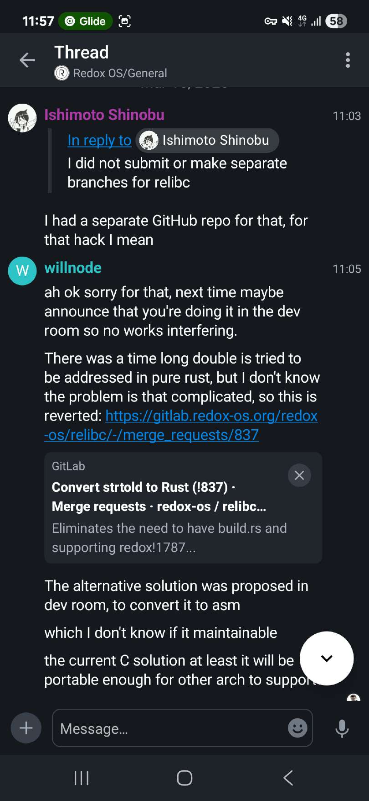

Then, I said that my code was in fact licensed under AGPLv3 which requires attribution (in sections 4 and 5). willnode deflected that with just the fact that he would love to have full support for x87 floating point numbers in relibc and then he said that GPL code is not allowed in relibc.


Also, if you came out with your own solution, why would you imply you have poor understanding of the problem?

Then I, again stated **explicitly** that the code which he used in relibc was actually **licensed** under AGPLv3 with the link to the crate has been provided to him with full commit history. willnode deflected it with just "ah ok." and switched the topic.
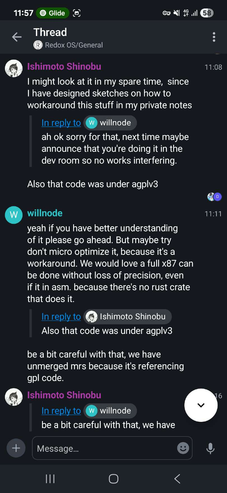

Again, I said to him that he violated the AGPLv3 and replied with ambigious "I don't know your repo existed", yes right after licensing concerns. Then I clarified it was beyond coincidence.
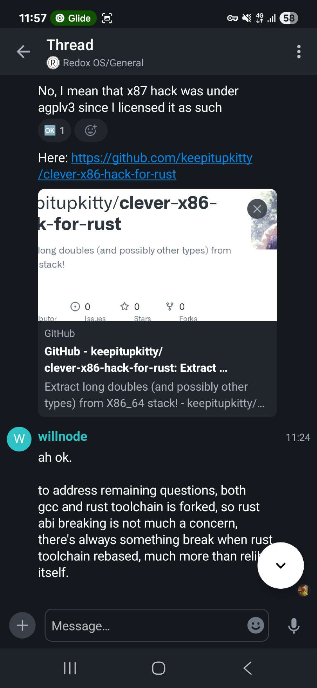

Another dev came in and said that "It's not how license violation works" and then willnode replied with "there is no other way to do it" and started talking about the issue with the Rust compiler. Yet I have asked him again:

> You could figure it years before me, why such a delay and such a suspicious timing

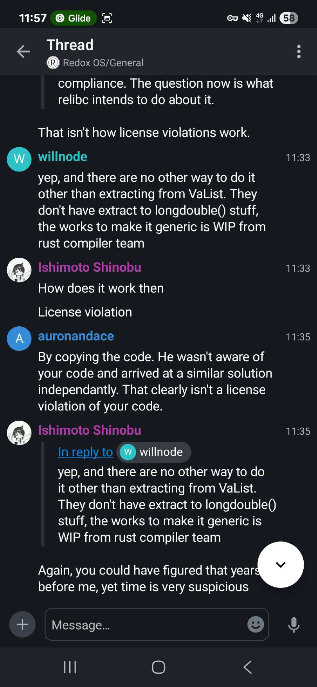

He deflected me then with "I arrive to that problem because it's an urgent request from os-test maintainer" which does not answer my question. The urgency claim doesn't hold up either — the os-test [commit](https://gitlab.com/sortix/os-test/-/commit/f8621e2369ed477a7e6a4e8d657ac11442e6c738) adding %Lf tests was merged on December 4th, 2025, three months before willnode's printf commit and one month before the buggy strtold implementation landed in relibc. If urgency was the driver, why the three month delay?

Also I added clarification about the same comments under the code here:
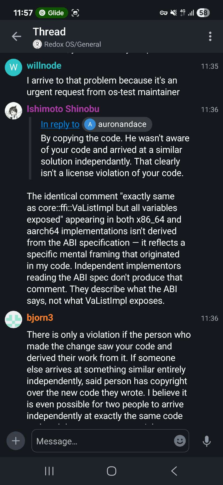

Then I asked willnode again, since he came up with the solution "on his own", then why couldn't he do the correct implementation of strtold? He didnt answer that.
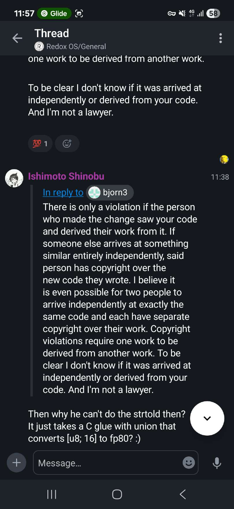

If you are wondering about solution for strtold, then you can look at it below (licensed under AGPLv3):

The Rust part:
```rust
use std::ffi::c_double;
use std::ffi::c_char;

#[inline]
fn fp80_from_f64(s: f64) -> [u8; 16] {
  let result: [u8; 16] = [0; 16];
  unsafe {
    core::arch::asm!(
        "fldl ({0})",
        "fstpt ({1})",
        in(reg) &raw const s,
        in(reg) result.as_ptr(),
        options(att_syntax)
    );
  }
  result
}

#[unsafe(no_mangle)]
pub unsafe extern "C" fn strtod(
    _s: *const c_char,
    _endp: *mut *mut c_char,
) -> c_double {
    todo!("Let's assume we got our strtod implemented")
}

#[unsafe(no_mangle)]
pub unsafe extern "C" fn __x86_strtold(
    s: *const c_char,
    endp: *mut *mut c_char,
    result: *mut [u8; 16]
) {
    let f = unsafe { strtod(s, endp) };
    let f80 = fp80_from_f64(f);
    unsafe { *result = f80 };
}
```

and the C part:
```c
#if defined(__x86_64__)
#define FP80_BITS 16
#elif defined(__i386__)
#define FP80_BITS 12
#endif

extern void __x86_strtold(
    const char *s,
    char **endp,
    unsigned char result[FP80_BITS]
);

long double my_strtold(
  const char* restrict str,
  char** restrict str_end)
{
  union {
    long double value;
    unsigned char bits[FP80_BITS];
  } fp80_t;

  fp80_t.value = 0.0L;

  __x86_strtold(str, str_end, fp80_t.bits);

  return fp80_t.value;
}
```

If you wish, you can convert it to assembly using `cc -S`.

Willnode said that strtold is easier, then why don't we see something similar to the code above in relibc then? ;)

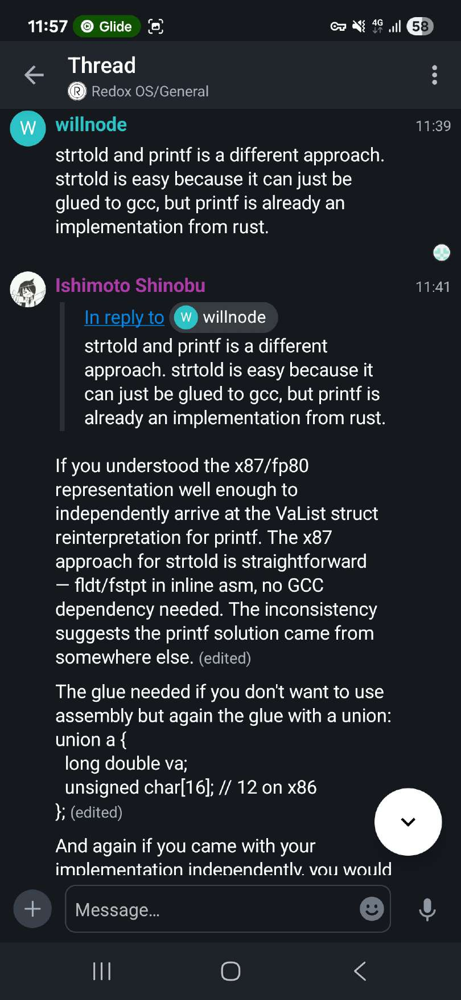

Then I get told that willnode is a trusted developer, which does not explain anything, so he is a trusted developer then what?

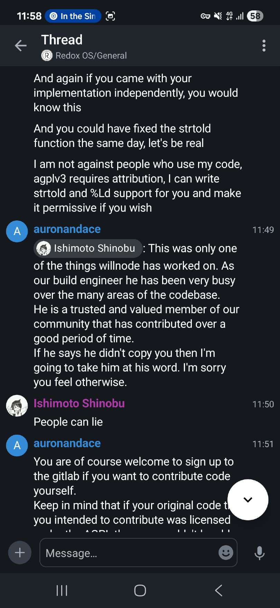

Then the founder of Redox OS who said it is "demonstrably clear" that he did not steal the code. I also refuted that argument.

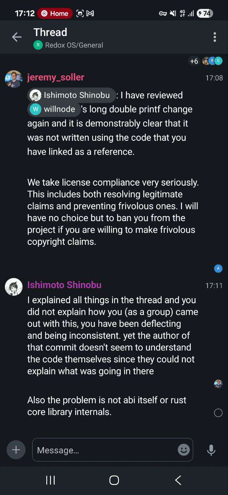

Merging code with pipelines failing (see the "Approval is optional" tag). "demonstrably clear" you say?

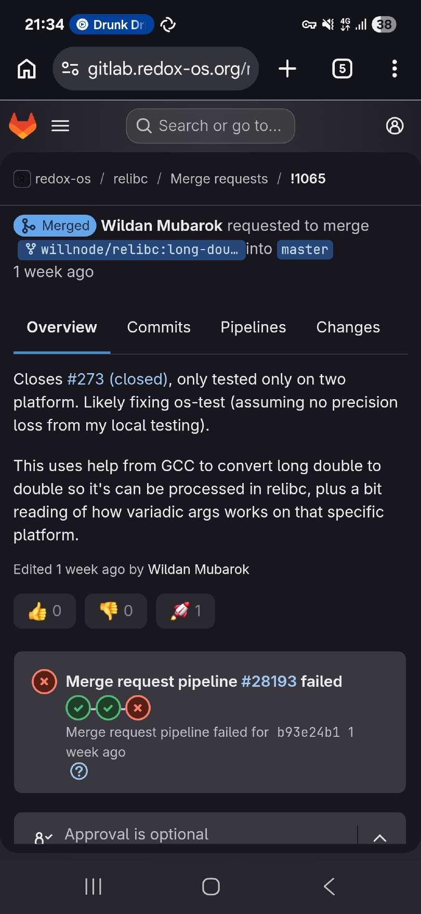

Then I get ban threats and eventually Jeremy banned me.


I also made an issue regarding this incident which was removed...


but there are screenshots of it.

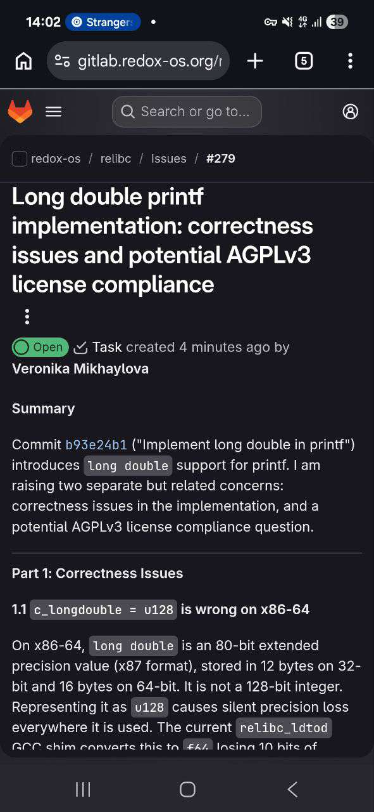
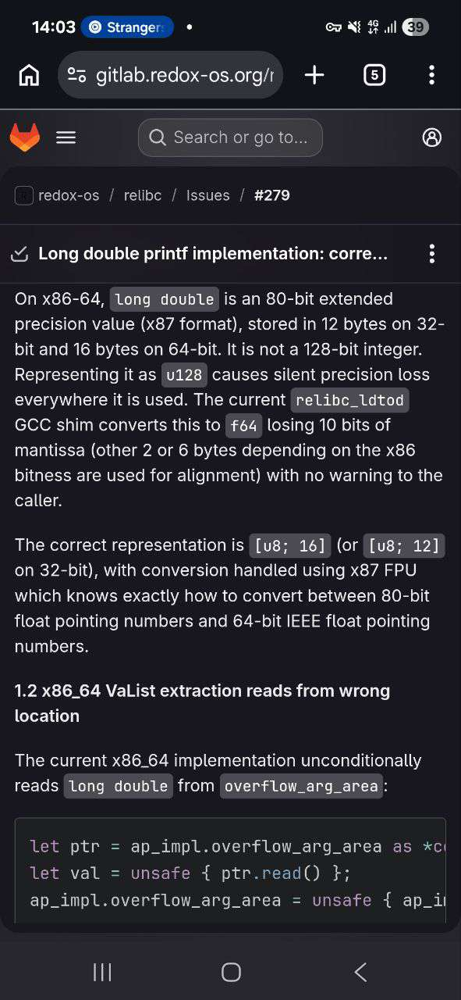
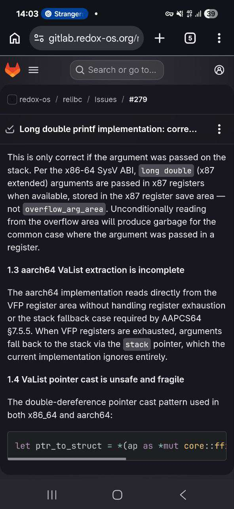
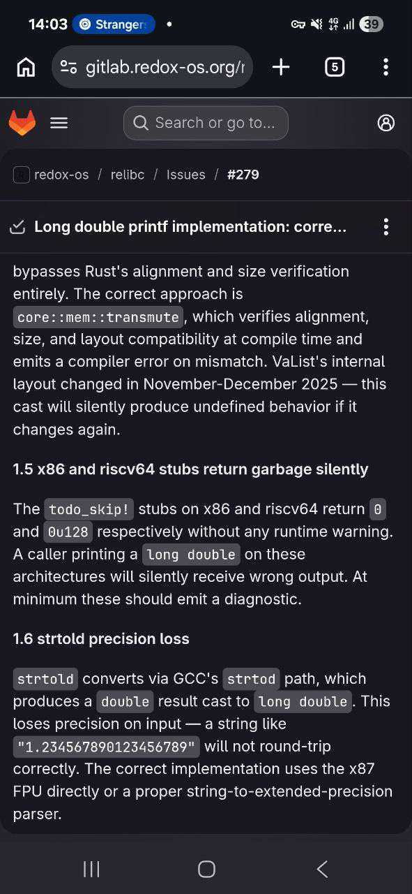
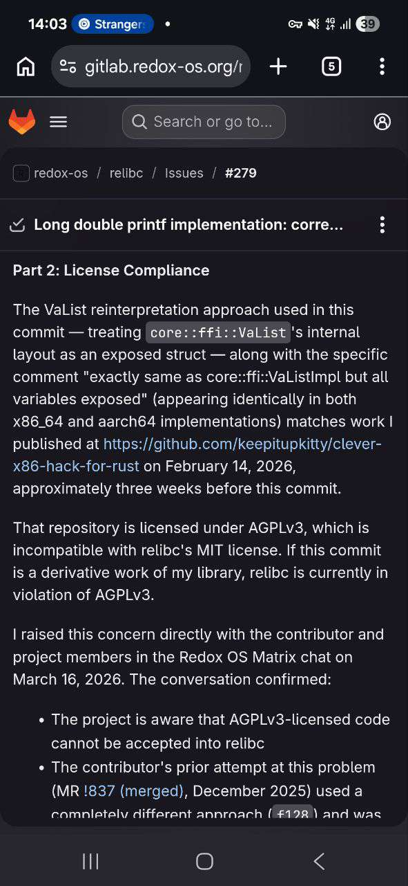
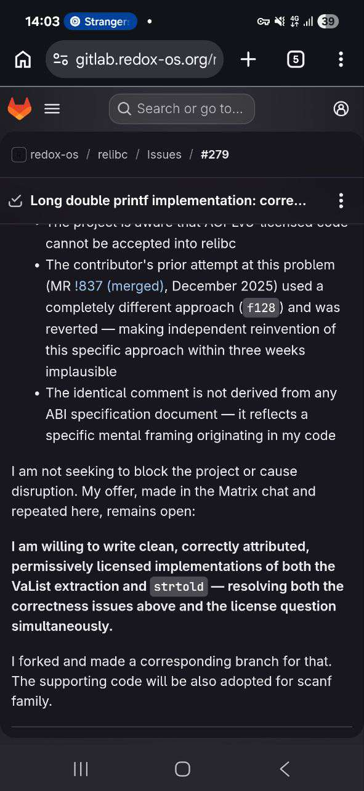

I find it ironic from a person who said that about code theft in MARMOS a year ago:

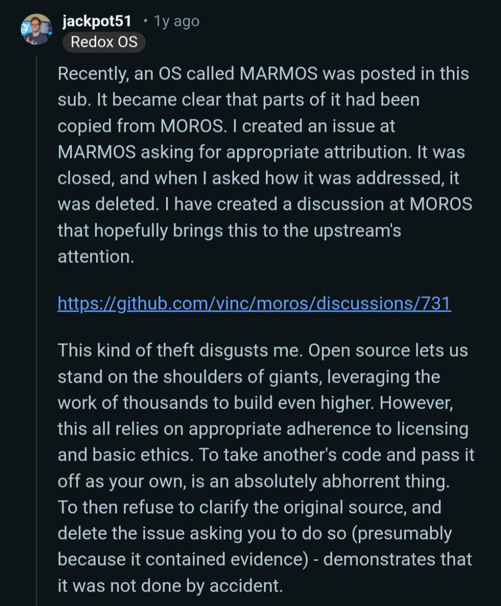

Do you think it has ended? Hell nawh!

## Further investigation
After getting banned I did not stop. I began documenting all of this, timestamps and other things. I remembered that GitHub provides traffic statistics and surprise surprise it revealed some good information! Remember the commit and merge request date and time? It is 4 Mar 2026 22:03:31 +0700 (Indonesian time zone) and this is another key of code stealing exposure. Look at the stats:

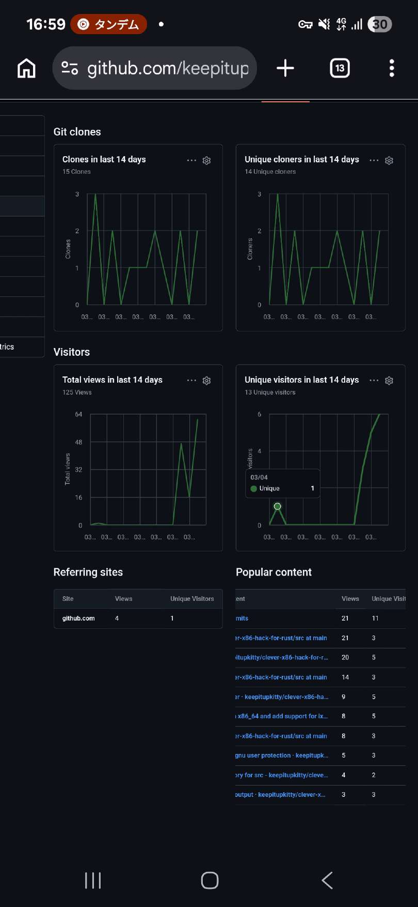
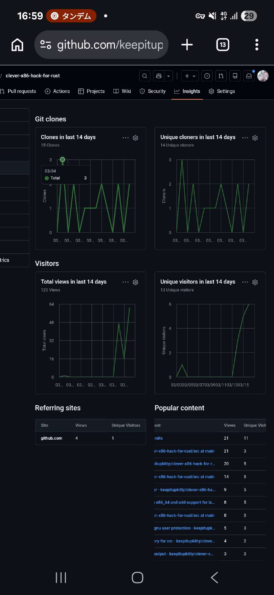

You can see that a repository with **ZERO** stars had **ZERO** unique viewers and out of nowhere there was a unique visitor on March 4th, 2026 — and then the traffic drops to zero again until March 15th. GitHub traffic data shows exactly 1 unique visitor and 3 clones on March 4. Someone didn't just browse the README. They cloned the entire repository, and hours later a merge request appeared in relibc implementing the same approach. MR !1065 was created at 22:03:31 Indonesian time on the same day. Draw your own conclusions.
The MR description itself is telling: "assuming no precision loss from my local testing" and "a bit reading of how variadic args works on that specific platform." Not "I implemented this from the ABI specification." A casual description of someone who read just enough to understand the structure without understanding the correctness requirements.

It does not end here! The same day (March 17th) I came across [this repository](https://github.com/thepowersgang/va_list-rs/tree/master) which was made by John Hodge also known as mutabah, especially the following file: impl-aarch64-elf.rs

Let's compare both of them:
```rust
// va_list-rs
#[repr(C)]
pub struct VaListInner {
    stack: *const u64,
    gr_top: *const u64,
    vr_top: *const u64,
    gr_offs: i32,
    vr_offs: i32,
}
```

```rust
// relibc
#[repr(C)]
struct VaListImpl {
    stack: *mut u8,
    gr_top: *mut u8,
    vr_top: *mut u8,
    gr_offs: i32,
    vr_offs: i32,
}
```

Must be just abi, right? Let's dive deeper!

```rust
// va_list-rs
impl VaListInner {
    pub unsafe fn get_gr<T>(&mut self) -> T {
        assert!(!self.gr_top.is_null());
        let rv = ptr::read((self.gr_top as usize - self.gr_offs.abs() as usize) as *const _);
        self.gr_offs += 8;
        rv
    }

    pub unsafe fn get_vr<T>(&mut self) -> T {
        assert!(!self.vr_top.is_null());
        let rv = ptr::read((self.vr_top as usize - self.vr_offs.abs() as usize) as *const _);
        self.vr_offs += 16;
        rv
    }
}
```

```rust
// relibc
    #[cfg(target_arch = "aarch64")]
    unsafe fn extract_longdouble(ap: &mut core::ffi::VaList) -> c_longdouble {
        // https://c9x.me/compile/bib/abi-arm64.pdf (quad precision)

        // exactly same as core::ffi::VaListImpl but all variables exposed
        #[repr(C)]
        struct VaListImpl {
            stack: *mut u8,
            gr_top: *mut u8,
            vr_top: *mut u8,
            gr_offs: i32,
            vr_offs: i32,
        }

        let ap_impl: &mut VaListImpl = unsafe {
            // The double deconstruct is intended
            let ptr_to_struct = *(ap as *mut core::ffi::VaList as *mut *mut VaListImpl);
            &mut *ptr_to_struct
        };

        let ptr = unsafe { ap_impl.vr_top.offset(ap_impl.vr_offs as isize) as *const c_longdouble };

        ap_impl.vr_offs += 16;

        unsafe { ptr.read() }
    }
```

You might argue that it just must be the ABI? And I will say yes! But a big BUT — on Linux and other UNIX-like operating systems that use ELF file format, the long double type is 128-bit quadruple precision IEEE 754 type with the size of 16 bytes per AAPCS64. Looking at §14.4 of the AAPCS64 specification, the va_arg pseudocode tells us exactly how long double gets extracted from variadic arguments.
When VFP registers are available, long double (binary128, 16 bytes) takes the "type passed in fp/simd registers" path — it reads from vr_top + vr_offs and advances vr_offs by 16. But crucially, before doing anything, it checks:

```c
if (offs >= 0)
    goto on_stack;  // VFP registers exhausted
```

When VFP registers are exhausted — which happens after 8 floating point arguments — vr_offs reaches zero and the value is on the stack, not in the register save area. The code must fall through to on_stack, align to 16 bytes, and read from __stack.
willnode's implementation never performs this check. It always reads from vr_top + vr_offs regardless of whether registers are exhausted. The result: pass more than 8 floating point arguments before your long double and you get garbage. Silently. No error, no crash — just wrong values printed.

Having this information we can again prove that willnode did not read the ABI at all, nor at least he has looked at the this pseudo-code, despite telling otherwise.

## TRVTH NVKE and conclusion
Just because you dared to come across the profile of the unknown to the world coder and thought "gee i cant do things on my own lets copy it from someone's project teehee" and hoped nobody will ever verify that? YOU. WERE. WRONG. Sometimes it takes just 1 reading and 1 comparing to see where it got from. I have offered you a rewrite under MIT, yet you banned me and deleted (as you thought) all the evidence, well, WRONG AGAIN. Even after re-reading all docs, specs and all, even reading failed pipeline logs (look [here](https://gitlab.redox-os.org/redox-os/relibc/-/jobs/89537) and [there](https://gitlab.redox-os.org/redox-os/relibc/-/jobs/89538)) it genuinely made me nauseated and my eyes began to bleed. I will say the following:

It is demonstrably clear, you do not respect other people, even THE ONES WHO WRITE UNDER PERMISSIVE LICENSES, you have no idea what your code does and the testing is so poor I'm not even sure if it is needed at all. You steal, discredit and ban people and also spread false information. You can look at the case happened with [GNOME in 2021](https://blogs.gnome.org/christopherdavis/2021/11/10/system76-how-not-to-collaborate/), such a poop show.

Anyway, I will keep on doing my project, especially my libc, drinking vanilla sugar flavored latte and eat сырники. Have a nice day!
